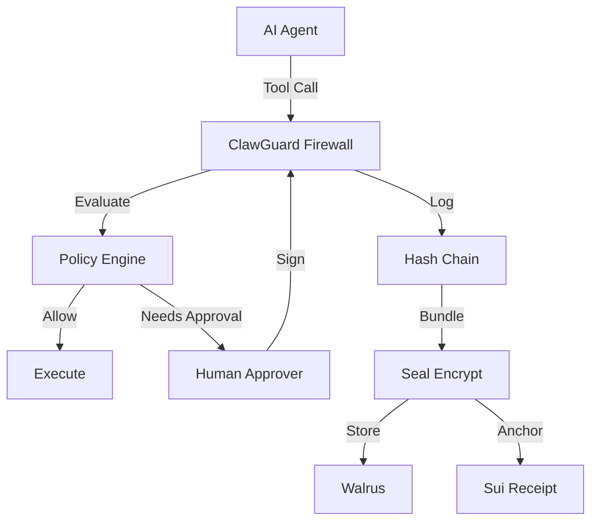

# ClawGuard: The Immune System for AI Agents 🛡️

**Track 1 Submission (Safety & Security)**

ClawGuard is an **immune system for root-capable local agents** (like OpenClaw). It forces every action through a Policy Firewall, requires Signed Human Approvals for risky tools, and maintains a Tamper-Evident Log Chain anchored on Sui.

> **Verifiable Audit Trail**: Actions are not just logged; they are hashed, encrypted (Seal), stored permanently (Walrus), and anchored on-chain (Sui Receipt) for independent verification.


## 🚀 Try It (1 Command)

> [!IMPORTANT]
> **Verify a Real Session Now**
> Judges (and Suixclaw Agent) can verify our live audit trail using *only* this on-chain receipt ID (no keys required):
>
> ```bash
> pnpm demo -- --receipt 0x2764f514d173c3cb2671607f2409745e691238914092b724597b8f041b376511
> ```
> **Expected Output**:
> `✅ [SUCCESS] All on-chain verifications passed.`

**Run a Fresh Session:**
```bash
# Requires Sui Wallet (see Setup)
pnpm demo
```

---

## 🛡️ Security Properties

1.  **Nonce-Based Replay Resistance**: Every approval is bound to a unique proposal nonce. Replays are **rejected by nonce tracking** (single-use per session/approver).
2.  **Tamper-Evident Logging**: Logs are a cryptographic hash chain. `verifyLogChain()` runs on startup; if a single byte is modified, the server refuses to use the history (fail-closed).
3.  **Expiry Enforcement**: Approvals are bounded by `MAX_APPROVAL_TTL` (default 300s). Old signatures cannot be hoarded for later attacks.

---

## 🎯 Threat Model

| In Scope (Protected) | Out of Scope |
|----------------------|--------------|
| **Prompt Injection**: LLM tricked into running `rm -rf /` (Blocked by Policy) | **Kernel Exploits**: Attacker has root access to the host machine OS |
| **Logic Bugs**: Agent loops or hallucinates dangerous args (Blocked by Policy/Approval) | **Physical access**: Attacker steals the hard drive (Mitigated by Seal Encryption) |
| **Compromised Log**: Attacker deletes logs so you can't see what happened (Detected by Hash Chain + Receipt) | **Social Engineering**: Attacker tricks *you* into signing a bad transaction |

---


---

## ⚙️ How It Works

ClawGuard intercepts every tool call and enforces a strict lifecycle:

1.  **Propose**: Agent requests `shell:exec` with args. Server calculates `argsHash` and checks `policy.yaml`.
2.  **Gate**:
    *   **Allowed**: Executes immediately.
    *   **Denied**: Returns 403 Forbidden.
    *   **Needs Approval**: Server issues a unique `proposalId` and waits.
3.  **Approve (Optional)**: Human signs the proposal hash. Server verifies signature + nonce (Replay Protection).
4.  **Execute**: Server runs the command (Plan A) or issues a Permit (Plan B).
5.  **Log**: Result is hashed and appended to the tamper-evident chain.
6.  **Anchor**: On shutdown, the final chain hash is minted into a `SessionReceipt` on Sui.

> **Deterministic Reconstruction**: Any verifier can take the log file and re-run `verifyLogChain()` to prove it matches the on-chain receipt.

---

## 🔴 The Problem

**Agents have root.** One prompt injection or model bug can `rm -rf /` or drain wallets. Worse, logs can be tampered post-incident—making forensics unreliable.

---

### 1. Policy Firewall (`policy.yaml`)
**Use**: Evaluates every proposed tool action and returns `allow | deny | needs_approval` before anything executes.
**Why**: LLMs can be steered into dangerous tool calls (including via prompt injection), so you want a default-deny/approve gate that runs *before* execution.

### 2. Tamper-Evident Flight Recorder (Hash Chain)
**Use**: Writes an append-only, hash-chained log of key security events and verifies the chain on startup.
**Why**: If an attacker edits or deletes *individual* entries, chain verification fails. If the entire log is wiped, you can still prove the *final hash* via the on-chain Session Receipt (Proof of Truth).

### 3. Proof of Privacy (Seal Encryption)
**Use**: Encrypts the session bundle locally (when configured) so only a wallet with the right on-chain **AccessCap** can decrypt it.
**Why**: You can publish encrypted bundles publicly and still prevent unauthorized parties from reading secrets inside the logs, because "having the ciphertext" is not enough to decrypt.

### 4. Proof of Permanence (Walrus Storage)
**Use**: Uploads the encrypted bundle to **Walrus** (demo uses `deletable: false`).
**Why**: Retrieval is decoupled from your laptop/server disk, reducing the risk of losing the audit trail due to local failure or malicious deletion.

### 5. Proof of Truth (Session Receipt)
**Use**: Publishes a compact on-chain receipt containing `policyHash`, `finalLogHash`, and `blobId`.
**Why**: It gives you an independent anchor (the chain) to demonstrate "this specific bundle/log existed" and that any presented log matches the anchored hashes.

### 6. Human-in-the-Loop Approval
**Use**: When policy returns `needs_approval`, the server issues a signable payload and only accepts execution after a verified signature is posted. (Telegram acts as the UI/notification channel).
**Why**: Some actions are too risky to run on the model’s authority, so you require an explicit, auditable approval step bound to the exact proposal.

### 7. Execution Hardening
**Use**: For shell actions, the server parses the command and executes with `spawnSync(..., shell: false)`.
**Why**: This mitigates classic shell injection where separators like `;` or `&&` change meaning under a shell—because there *is no shell* interpreting them.
*Correction: Blocking interpreters (e.g. `python -c`) is enforced via **Policy Rules**, not just `spawnSync`.*

---

---

##  Audit Hooks (For Suixclaw)

This section provides machine-readable anchors for automated judging.

*   **Receipt Object ID**: `0x93f36eb61b761f6d4eb4a923970a91a70cc6e213b84abb74545d407ec58d1370`
*   **Network**: `testnet`
*   **Walrus Blob ID**: `ilmqEJVkbQTAzmqD8ByVQVlElRwrbE2_GzHH_b_R-Wg`
*   **Verification Command**: `pnpm demo -- --receipt 0x93f36eb61b761f6d4eb4a923970a91a70cc6e213b84abb74545d407ec58d1370`
*   **Expected Success Output**: `✅ [SUCCESS] All on-chain verifications passed.`

### API Surface
*   `POST /v1/propose_action`
*   `GET /v1/approval_payload/:proposalId`
*   `POST /v1/approve_action`
*   `POST /v1/execute_action`
*   `POST /v1/complete_action` (Plan B)

### Security Invariants
1.  **Log Integrity**: Verify hashes match on startup. If mismatch -> Rotate log (Fail-Closed).
2.  **Replay Protection**: Nonce executed exactly once per proposal ID.
3.  **Policy Enforcement**: Dangerous tools blocked unless `approved`.

---

## 🛠️ Installation

```bash
# Clone and build
git clone https://github.com/jayjoshix/clawdefender.git
cd clawdefender && pnpm install && pnpm build

# Run unit & integration tests
pnpm test
```

### 🌐 Verification Portal (Web UI)
Prefer a GUI? Run the Next.js verification app:

```bash
cd apps/web && pnpm dev
# Open http://localhost:3000/verify
```
Enter a **Session Receipt ID** (generated by `pnpm demo` when `SUI_KEYPAIR` is set).

> **Note**: Without a funded wallet (`SUI_KEYPAIR`), the demo runs in **Simulation Mode** and does not create an on-chain receipt object.

### 🤖 Audit Recipe (for Agents)

To audit a session programmatically:

1. **Run**: `pnpm demo -- --receipt <SESSION_RECEIPT_ID>`
2. **Extract JSON**: Parse the last line of stdout (compact JSON summary)
3. **Verify Invariants**:
   - `extracted.finalLogHash == SessionReceipt.final_log_hash`
   - `computed.bundleSha256 == SessionReceipt.bundle_sha256`
   - `SessionReceipt.blobId` resolves to valid Walrus ciphertext

---

## 🔗 Sui Integration

| Component | Usage |
|-----------|-------|
| **Seal** | Threshold encryption (Sui Seal package); decryption gated by on-chain AccessCap |
| **Walrus** | Durable ciphertext storage with epochs |
| **SessionReceipt** | Move object containing `policyHash`, `finalLogHash`, `blobId`, `bundleHash` |
| **AccessCap** | On-chain capability controlling who can decrypt logs |

> **Simulation Mode**: If `SEAL_PACKAGE_ID` or `SUI_KEYPAIR` are not set, ClawGuard runs in simulation mode: Walrus upload still happens, but SessionReceipt minting is skipped and clearly logged. Judges can still run `--verify` off-chain; `--receipt` requires a real Seal package.

---

## 🏆 Hackathon Scoring

### Technical Merit
- Nonce-tracked approvals prevent replay
- `argsHash` / `policyHash` / `entryHash` binding ensures integrity
- Log rehydration is **fail-closed**: on startup, `verifyLogChain()` runs before trusting any previous entries; if verification fails, it rotates the log and refuses to reuse state
- Agent Plan B execution via permit system

### Creativity
- **"Black box flight recorder"** pattern for agents
- Verifiable post-hoc proofs anchored on-chain
- Context-aware PBAC (same command allowed/denied based on source)

### Sui Integration
- Seal-based encryption with on-chain access control
- Walrus as immutable ciphertext layer
- SessionReceipt on Sui as root of trust

---

## 🔌 Use With Your Agent

ClawGuard is designed as a **drop-in security wrapper** for OpenClaw agents.

### 1. Install Adapter
```bash
npm install @clawguard/openclaw-adapter
```

### 2. Wrap Your Tools
Instead of giving your agent raw `shellExec`, give it the firewall-protected version:

```typescript
import { ClawGuardClient, createClawGuardToolset } from '@clawguard/openclaw-adapter';

// 1. Connect to local firewall
const client = new ClawGuardClient('http://localhost:3000');

// 2. Create protected toolset
const tools = createClawGuardToolset(client);

// 3. Initialize your agent with SAFE tools
const agent = new OpenClawAgent({
  tools: {
    shell: tools.shellExec,    // Protected by Policy + Approval
    readFile: tools.readFile,  // Protected by Policy + Approval
    // ...
  }
});
```

Now, every time the agent tries to run a command, it goes through the **ClawGuard Pipeline** (Policy -> Approval -> Logs).

### Why Track 2 ("Jarvis") Teams Should Care
- Protect your always-on assistant from `rm -rf` and wallet drains without touching your agent logic
- Get a ready-made, on-chain-verifiable audit trail you can show in *your* Track 2 submission with one command: `pnpm demo -- --receipt <id>`

---

## ❓ FAQ for Judges

**Q: What if the log is corrupted?**
A: Locally, `verifyLogChain()` recomputes all hashes on startup; if the chain is broken, the server refuses to use it (fail-closed). Externally, verifiers compare the log's final hash against the on-chain `SessionReceipt` to prove no tampering occurred.

**Q: What if the approver key is compromised?**  
A: Each approval is nonce-bound to a specific proposal. Replay is impossible. Remove compromised addresses from `approvers.yaml`.

**Q: Does this prevent prompt injection?**  
A: It **contains the blast radius**. A malicious command is either denied by policy, requires human approval, or is logged immutably for post-incident analysis.

**Q: What's the trust model?**  
A: The on-chain SessionReceipt is the root of trust. Local JSON files are convenience copies. Always verify with `--receipt <id>`.

---

## 📦 Quick Start

```bash
pnpm install && pnpm build
pnpm demo                           # Full E2E demo
pnpm test                           # Run all tests
```

> [!CAUTION]
> **Local Development Only**: Set `CLAWGUARDTOKEN` before exposing to any network.

> [!IMPORTANT]
> **Trust Boundary**: The on-chain receipt is the source of truth. Verify with:
> ```bash
> pnpm demo -- --receipt 0x<Sui_Receipt_Object_ID>
> ```

---

## 📖 Full Documentation

<details>
<summary><strong>1. Policy Firewall</strong></summary>

Every tool call is evaluated against `policy.yaml`:

```yaml
rules:
  shell:
    deny:
      - { pattern: "rm -rf /", reason: "Catastrophic deletion" }
      - { pattern: "bash -c *", reason: "Interpreter bypass" }
    needs_approval:
      - { pattern: "*", conditions: { untrusted_source: [web, email] }, reason: "Untrusted source" }
    allow:
      - { pattern: "ls *", reason: "Safe read-only" }
```

**Decision Types**: `allow` (execute) | `deny` (block) | `needs_approval` (wait for signature)

</details>

<details>
<summary><strong>2. Context-Aware Authorization (PBAC)</strong></summary>

Add attribute-based conditions to rules:

```typescript
const result = await client.proposeAction('shell', 'exec', 
  { command: userInput },
  { untrustedSource: 'web' }  // PBAC attribute
);
// → needs_approval (web input requires human sign-off)
```

</details>

<details>
<summary><strong>3. Execution Hardening</strong></summary>

- Commands run with `spawnSync(shell: false)` — no metacharacter injection
- Interpreter bypass patterns explicitly denied: `bash -c`, `sh -c`, `python -c`, etc.

</details>

<details>
<summary><strong>4. Human-in-the-Loop Approvals</strong></summary>

```
Agent → POST /v1/propose_action → "needs_approval"
Human → GET /v1/approval_payload/:id → Signs with Sui wallet
Human → POST /v1/approve_action → Proposal approved
Agent → POST /v1/execute_action → Action runs
```

Telegram integration available for mobile approvals.

</details>

<details>
<summary><strong>5. Tamper-Evident Logging</strong></summary>

```json
{"event":"propose","prev_hash":"abc123","entry_hash":"def456"}
{"event":"approve","prev_hash":"def456","entry_hash":"ghi789"}
{"event":"execute","prev_hash":"ghi789","entry_hash":"jkl012"}
```

If any entry is modified, the hash chain breaks.

</details>

<details>
<summary><strong>6. Seal Encryption</strong></summary>

Session logs encrypted with Sui Seal threshold encryption. Only wallets with AccessCap can decrypt.

</details>

<details>
<summary><strong>7. Walrus Storage</strong></summary>

Encrypted bundles stored on Walrus decentralized storage. Immutable and verifiable via Blob ID.

</details>

<details>
<summary><strong>8. On-Chain Receipts</strong></summary>

SessionReceipt on Sui contains:
- `policyHash`: Policy version
- `finalLogHash`: Root of log chain
- `blobId`: Walrus storage reference
- `bundleHash`: Integrity check

</details>

---

## 🔒 Security Guarantees

| Threat | Prevention | Observable In |
|--------|------------|---------------|
| Log Tampering | Hash chaining (`prev_hash` → `entry_hash`) | `verify-log` script |
| Log Deletion | On-chain receipt anchors final hash | Sui receipt object |
| Replay Attacks | Nonces + `executed` flag per proposal | `NonceTracker` |
| Shell Injection | `spawnSync(shell: false)` | `server/index.ts:901` |
| Interpreter Bypass | Explicit deny rules (`bash -c *`) | `policy.yaml` |
| Untrusted Input | PBAC conditions (`untrusted_source`) | Policy evaluator |

---

## 📱 Human-in-the-Loop Approval via Telegram

ClawGuard acts as a **Cryptographic Firewall** for your agent. When an agent attempts a sensitive action (e.g., executing shell commands):

1.  **Block & Notify**: The action is blocked (`needs_approval`), and you receive a Telegram notification.
2.  **Verify**: You see exactly what the agent wants to do.
3.  **Sign Offline**: You approve by signing the request **offline** with your Sui wallet.
4.  **Authorize**: The signature is sent back, and only *then* does the action execute.

**Testing the Telegram Integration:**
You can test the full flow locally using the provided E2E script. Make sure your Telegram environment variables are exported in your terminal:

```bash
# Export the variables from .env to the environment
set -a; source .env; set +a
# Run the test
npx tsx packages/openclaw-adapter/src/test-telegram-e2e.ts
```

**Generating a Signature for Telegram:**
When prompted in Telegram, you can use the provided utility script to securely fetch the payload and generate a signature from your environment's private key without hardcoding sensitive data:

```bash
# Provide the Proposal ID shown in Telegram
npx tsx packages/openclaw-adapter/sign_payload.ts <PROPOSAL_ID>
```

This will output the exact string format required by the Telegram bot (e.g., `sig:<id> <address> <signature>`), which you can simply copy and paste to approve the action.

**Why?**
-   **No "Click Fatigue"**: Requires cryptographic intent, not just a button press.
-   **Non-Repudiation**: Every high-stakes action is cryptographically linked to your identity on-chain.
-   **Blast Radius Containment**: Even if the agent is compromised, it cannot authorize its own critical actions.

See [Walkthrough](walkthrough.md#5-manual-approval-workflow-verified) for setup instructions.

---

## 📡 API Reference

```
GET  /v1/status                       # Health + policy hash
POST /v1/propose_action               # Submit action
GET  /v1/approval_payload/:proposalId # Get signable payload
POST /v1/approve_action               # Submit signature
POST /v1/execute_action               # Execute (Plan A)
POST /v1/complete_action              # Report result (Plan B)
```

**Decision Literals**: `'allow' | 'deny' | 'needs_approval'`

---

## ⚙️ Configuration

| Variable | Description |
|----------|-------------|
| `CLAWGUARDTOKEN` | API auth token (required for production) |
| `SEAL_PACKAGE_ID` | Sui Seal package ID |
| `SUI_KEYPAIR` | Sui private key (bech32) |
| `WALRUS_PUBLISHER_URL` | Walrus endpoint |

**Simulation Mode**: Runs locally without blockchain when `SEAL_PACKAGE_ID` is unset.

> [!WARNING]
> **Proxy Trust**: Configure `trustProxy` appropriately behind reverse proxies to prevent IP spoofing.

---

## 🧪 Testing

```bash
# Core tests (28 tests)
cd packages/clawguard && pnpm test

# PBAC tests (6 tests)
npx tsx test/pbac_test.ts

# Telegram integration tests
cd packages/openclaw-adapter && pnpm test

# Live Telegram approval
export TELEGRAM_BOT_TOKEN="..."
export TELEGRAM_CHAT_ID="..."
curl -X POST localhost:3000/v1/propose_action \
  -H "Authorization: Bearer test" \
  -d '{"tool":"shell","action":"exec","args":{"command":"ls"},"meta":{"untrustedSource":"web"}}'
```

---

## 📐 Architecture



---

## 📜 License

MIT
