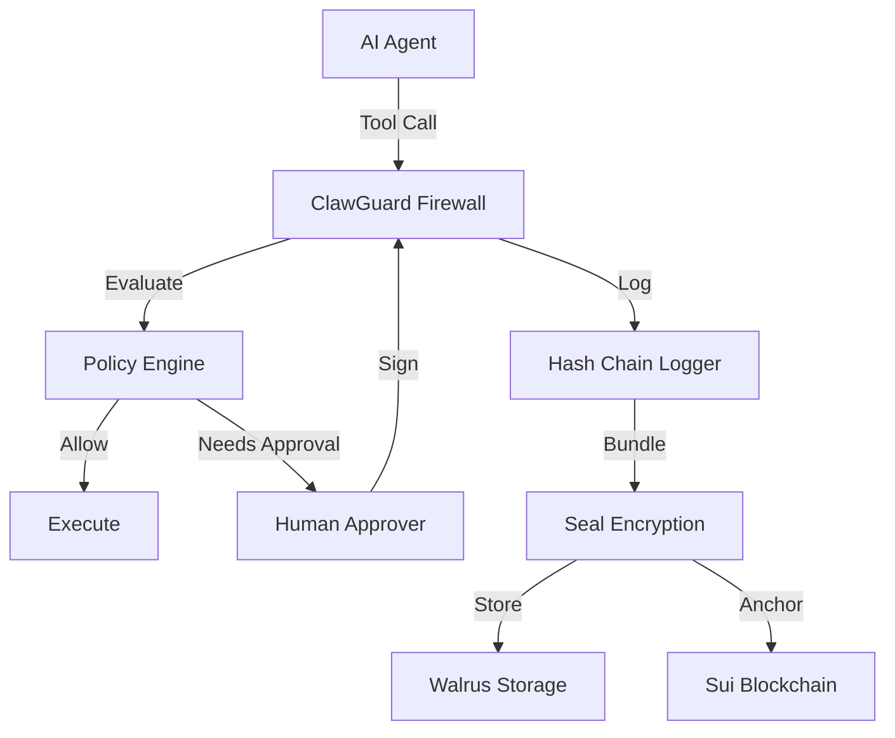

# ClawGuard 🛡️

**The Policy Firewall & Digital Blackbox for AI Agents**


ClawGuard is a security layer that sits between your AI Agent (e.g., OpenClaw, Eliza) and the sensitive tools it uses. It intercepts every tool call, enforces policy-as-code, and anchors a tamper-evident audit trail to the Sui blockchain.

---

## Table of Contents

1. [Quick Start](#quick-start)
2. [Policy Firewall](#1-policy-firewall)
3. [Context-Aware Authorization (PBAC)](#2-context-aware-authorization-pbac)
4. [Execution Hardening](#3-execution-hardening)
5. [Human-in-the-Loop Approvals](#4-human-in-the-loop-approvals)
6. [Tamper-Evident Logging](#5-tamper-evident-logging)
7. [Seal Encryption](#6-seal-encryption)
8. [Walrus Storage](#7-walrus-storage)
9. [On-Chain Receipts](#8-on-chain-receipts)
10. [OpenClaw Integration](#openclaw-integration)
11. [API Reference](#api-reference)
12. [Configuration](#configuration)
13. [Public Interface Contract](#public-interface-contract)
14. [Testing](#testing)
15. [Security Guarantees](#security-guarantees)

---

## Quick Start

```bash
# Install dependencies
pnpm install && pnpm build

# Run the server
pnpm start

# Run E2E demo (Policy → Log → Seal → Walrus → Sui)
pnpm demo

# Run security tests
pnpm test
```

> [!CAUTION]
> **Local Development Only**: By default, ClawGuard runs in unauthenticated dev mode (`CLAWGUARDTOKEN` not set). **Never expose to a network without setting `CLAWGUARDTOKEN`**.

> [!IMPORTANT]
> **Trust Boundary**: The on-chain receipt is the source of truth, not local JSON files. For audit verification, always use the pure on-chain verification path:
> ```bash
> pnpm demo -- --receipt 0x<Sui_Receipt_Object_ID>
> ```

---

## 1. Policy Firewall

Every tool call (shell, filesystem, network, browser) is evaluated against a YAML policy before execution.

### Configuration

Edit `packages/clawguard/policy.yaml`:

```yaml
version: "1.0"
defaults:
  decision: deny
  reason: "Action not explicitly allowed"

rules:
  shell:
    deny:
      - { pattern: "rm -rf /", reason: "Catastrophic deletion" }
      - { pattern: "bash -c *", reason: "Interpreter bypass blocked" }
    needs_approval:
      - { pattern: "*", conditions: { untrusted_source: [web, email] }, reason: "Untrusted source" }
    allow:
      - { pattern: "ls *", reason: "Safe read-only" }
      - { pattern: "cat *", reason: "Safe read-only" }
```

### Decision Types

| Decision | Behavior |
|----------|----------|
| `allow` | Execute immediately |
| `deny` | Block with error |
| `needs_approval` | Wait for human signature |

### Precedence

Rules are evaluated in order: **Deny → Needs Approval → Allow → Default**. The first match wins.

---

## 2. Context-Aware Authorization (PBAC)

Add attribute-based conditions to rules. The most important condition is `untrusted_source`.

### How It Works

1. **Agent receives input** from web/email/clipboard
2. **Adapter tags it**: `meta: { untrustedSource: 'web' }`
3. **Policy evaluates**: If the rule has `conditions: { untrusted_source: [web] }`, it matches
4. **Result**: The action requires human approval before execution

### Usage

```typescript
// Tag untrusted input
const result = await client.proposeAction('shell', 'exec', 
  { command: userInput },
  { untrustedSource: 'web' }  // PBAC attribute
);

// Result: needs_approval (requires signature)
```

### Policy Example

```yaml
shell:
  needs_approval:
    - pattern: "*"
      conditions:
        untrusted_source: [web, email, clipboard]
      reason: "External input requires approval"
```

---

## 3. Execution Hardening

Prevents shell injection attacks by running commands without a shell interpreter.

### Implementation

- Commands run with `spawnSync(shell: false)` – no shell metacharacters interpreted
- Interpreter bypass patterns are explicitly denied: `bash -c`, `sh -c`, `python -c`, `node -e`, `perl -e`

### Attack Prevention

```bash
# Attacker tries: "ls; rm -rf /"

# With shell:true → DANGEROUS (both commands run)
# With shell:false → SAFE (interpreted as single command "ls; rm -rf /" which fails)
```

### Denied Patterns

These are blocked by default in `policy.yaml`:

```yaml
shell:
  deny:
    - { pattern: "sh -c *", reason: "Shell interpreter bypass" }
    - { pattern: "bash -c *", reason: "Shell interpreter bypass" }
    - { pattern: "python -c *", reason: "Python interpreter bypass" }
    - { pattern: "node -e *", reason: "Node interpreter bypass" }
    - { pattern: "perl -e *", reason: "Perl interpreter bypass" }
```

---

## 4. Human-in-the-Loop Approvals

High-risk actions require a cryptographic signature from an authorized wallet.

### Approval Flow

```
Agent → POST /v1/propose_action → "needs_approval"
                    ↓
Human → GET /v1/approval_payload/{proposalId} → Signs with Sui wallet
                    ↓
Human → POST /v1/approve_action (signature) → Proposal approved
                    ↓
Agent → POST /v1/execute_action → Action runs
```

### Configure Approvers

Edit `approvers.yaml`:

```yaml
approvers:
  - address: "0x1234..."
    name: "Alice (Security)"
  - address: "0x5678..."
    name: "Bob (Ops)"
```

### Telegram Integration

Approvals can be sent via Telegram bot for mobile approval:

```bash
export TELEGRAM_BOT_TOKEN="your-bot-token"
export TELEGRAM_CHAT_ID="your-chat-id"
```

---

## 5. Tamper-Evident Logging

Every event is logged with a cryptographic link to the previous event.

### Log Structure

```json
{"event":"propose","data":{...},"prev_hash":"abc123","entry_hash":"def456"}
{"event":"approve","data":{...},"prev_hash":"def456","entry_hash":"ghi789"}
{"event":"execute","data":{...},"prev_hash":"ghi789","entry_hash":"jkl012"}
```

### Tamper Detection

If any log entry is modified or deleted, the hash chain breaks.

### Verify Log Chain

```bash
pnpm verify-log -- logs/session-<id>.jsonl
# Output: ✅ Log chain is valid and tamper-free
```

---

## 6. Seal Encryption

Session logs are encrypted using Sui Seal threshold encryption.

### How It Works

1. Logs are bundled at session end
2. Encrypted with a policy that only the session owner can decrypt
3. Only authorized wallets can access the audit trail

### Configuration

```bash
export SEAL_PACKAGE_ID="0x..."  # Sui Seal package
export SUI_KEYPAIR="suiprivkey..."
```

### Usage

Encryption happens automatically in the demo:

```bash
pnpm demo  # Encrypts and uploads to Walrus
```

---

## 7. Walrus Storage

Encrypted log bundles are stored permanently on Walrus decentralized storage.

### Benefits

- **No single point of failure**: Distributed across multiple nodes
- **Immutable**: Once stored, cannot be deleted
- **Verifiable**: Blob ID anchored on-chain

### Configuration

```bash
export WALRUS_PUBLISHER_URL="https://publisher.walrus-testnet.walrus.space"
export WALRUS_AGGREGATOR_URL="https://aggregator.walrus-testnet.walrus.space"
```

---

## 8. On-Chain Receipts

A receipt object is created on Sui containing:

- Session ID
- Final log hash
- Walrus Blob ID
- Timestamp

### Verification

Auditors can fetch the receipt, download the blob from Walrus, decrypt, and verify the hash chain independently:

```bash
pnpm demo -- --receipt 0x<Sui_Object_ID>
```

---

## OpenClaw Integration

Use ClawGuard as the security layer for your OpenClaw agents:

```bash
pnpm add @clawguard/openclaw-adapter
```

```typescript
import { ClawGuardClient, executeWithClawGuard } from '@clawguard/openclaw-adapter';

const client = new ClawGuardClient('http://localhost:3000', process.env.CLAWGUARDTOKEN);

// 1. Simple execution (trusted agent, allowed action)
const result = await executeWithClawGuard(client, 'shell', 'exec', { command: 'ls -la' });
// → Executes immediately

// 2. External input (PBAC triggers approval)
const result = await client.proposeAction('shell', 'exec', 
  { command: userInput }, 
  { untrustedSource: 'web' }
);
// → Returns "needs_approval" → Agent waits for human signature

// 3. Plan A vs Plan B
// Plan A (ClawGuard executes): shell, filesystem
// Plan B (Agent executes): network, browser → Use /v1/complete_action to report result
```

---

## API Reference

| Endpoint | Method | Description |
|----------|--------|-------------|
| `/v1/status` | GET | Server health + policy hash |
| `/v1/propose_action` | POST | Submit action for policy evaluation |
| `/v1/approval_payload/:id` | GET | Get signable payload for approval |
| `/v1/approve_action` | POST | Submit signed approval |
| `/v1/execute_action` | POST | Execute approved action (Plan A) |
| `/v1/complete_action` | POST | Report agent-side execution (Plan B) |

---

## Configuration

| Variable | Description | Default |
|----------|-------------|---------|
| `CLAWGUARDTOKEN` | API authentication token | Unset (dev mode) |
| `POLICY_PATH` | Path to `policy.yaml` | `./policy.yaml` |
| `APPROVERS_PATH` | Path to `approvers.yaml` | `../../approvers.yaml` |
| `LOGDIR` | Log directory | `.logs` |
| `PORT` | API port | `3000` |
| `SEAL_PACKAGE_ID` | Sui Seal package ID | Required for encryption |
| `SUI_KEYPAIR` | Sui private key | Auto-generated |
| `WALRUS_PUBLISHER_URL` | Walrus publisher endpoint | Testnet default |

### Simulation vs On-Chain Mode

ClawGuard runs in **simulation mode** when blockchain-related env vars are not set:

| Mode | When | Behavior |
|------|------|----------|
| **Simulation** | `SEAL_PACKAGE_ID` not set or `0x0` | Logs locally, skips Seal encryption and on-chain receipts |
| **On-Chain** | `SEAL_PACKAGE_ID` + `SUI_KEYPAIR` set | Full Seal encryption, Walrus upload, Sui receipt |

> **Tip**: For local development/testing, simulation mode is sufficient. Set the blockchain vars only for production or demo verification.

> [!WARNING]
> **Proxy Trust**: If running behind a reverse proxy (nginx, cloudflare), configure `trustProxy` appropriately. IP-based rate limiting can be bypassed via `X-Forwarded-For` spoofing if proxy trust is misconfigured.

---

## Public Interface Contract

This section documents the canonical API paths and decision literals to prevent regressions.

### API Endpoints

```
GET  /v1/status
POST /v1/propose_action
GET  /v1/approval_payload/:proposalId
POST /v1/approve_action
POST /v1/execute_action
POST /v1/complete_action
```

### Decision Literals

```typescript
type PolicyDecision = 'allow' | 'deny' | 'needs_approval';
```

### PBAC Attribute Naming

| Context | Format | Example |
|---------|--------|--------|
| API Request (`meta`) | camelCase | `untrustedSource: 'web'` |
| Policy YAML (`conditions`) | snake_case | `untrusted_source: [web, email]` |

The evaluator automatically maps between these formats.

---

## Testing

### Run All Tests

```bash
# Core tests (hash-chain + policy evaluator)
cd packages/clawguard && pnpm test

# PBAC policy tests
cd packages/clawguard && npx tsx test/pbac_test.ts

# Telegram integration tests
cd packages/openclaw-adapter && pnpm test
```

### E2E Demo & Verification

```bash
# Full E2E demo (Policy → Log → Seal → Walrus)
pnpm demo

# Verify on-chain receipt
pnpm demo -- --verify

# Verify specific receipt
pnpm demo -- --receipt 0x<Sui_Object_ID>

# Test Seal access control (adversarial)
pnpm demo -- --verify-denied

# Verify log chain integrity
pnpm verify-log -- demo/logs/session-<id>.jsonl
```

### Live API Testing

```bash
# Start server
cd packages/clawguard && CLAWGUARDTOKEN=test pnpm start

# Test allowed action
curl -X POST http://localhost:3000/v1/propose_action \
  -H "Authorization: Bearer test" \
  -H "Content-Type: application/json" \
  -d '{"tool":"shell","action":"exec","args":{"command":"ls -la"}}'

# Test denied action
curl -X POST http://localhost:3000/v1/propose_action \
  -H "Authorization: Bearer test" \
  -H "Content-Type: application/json" \
  -d '{"tool":"shell","action":"exec","args":{"command":"rm -rf /"}}'

# Test PBAC (untrusted source triggers approval)
curl -X POST http://localhost:3000/v1/propose_action \
  -H "Authorization: Bearer test" \
  -H "Content-Type: application/json" \
  -d '{"tool":"shell","action":"exec","args":{"command":"ls"},"meta":{"untrustedSource":"web"}}'
```

### Live Telegram Approval Testing

```bash
# Set environment variables
export TELEGRAM_BOT_TOKEN="your-bot-token"
export TELEGRAM_CHAT_ID="your-chat-id"
export TELEGRAM_ALLOWED_USERS="your-user-id"

# Start server with Telegram enabled
cd packages/clawguard && CLAWGUARDTOKEN=test pnpm start

# Trigger approval (in another terminal)
curl -X POST http://localhost:3000/v1/propose_action \
  -H "Authorization: Bearer test" \
  -H "Content-Type: application/json" \
  -d '{"tool":"shell","action":"exec","args":{"command":"ls"},"meta":{"untrustedSource":"web"}}'

# Check Telegram for approval message!
```

---

## Security Guarantees

| Threat | Prevention | Observable In |
|--------|------------|---------------|
| Log Tampering | Hash chaining (`prev_hash` → `entry_hash`) | `verify-log` script, log files |
| Log Deletion | On-chain receipt anchors final hash | Sui receipt object |
| Replay Attacks | Nonces + `executed` flag per proposal | `NonceTracker`, proposal state |
| Race Conditions | Single-process atomic checks on proposal state | `proposals.get()` + `executed` flag |
| Shell Injection | `spawnSync(shell: false)` in execution path | `server/index.ts:901` |
| Interpreter Bypass | Explicit deny rules (`bash -c *`, etc.) | `policy.yaml` deny section |
| Untrusted Input | PBAC conditions gate by `untrusted_source` | Policy evaluator, tests |
| Policy Evasion | Canonical argument parsing, path normalization | `evaluator.ts` matching logic |

---

## Architecture



---

## License

MIT
