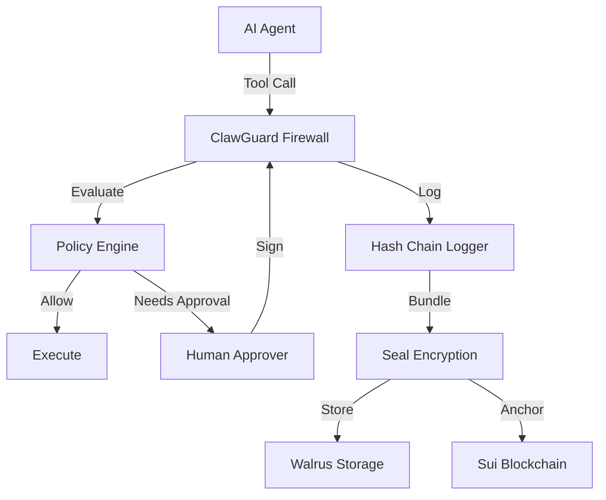

# ClawGuard 🛡️

**The Policy Firewall & Digital Blackbox for AI Agents**


**ClawGuard** is a security layer that sits between your AI Agent (e.g., OpenClaw, Eliza) and the sensitive tools it uses. It intercepts every tool call, enforces policy-as-code, and **anchors a tamper-evident audit trail** to the Sui blockchain.

> **Hackathon Ready**: Fully functional E2E demo with Seal threshold encryption and Walrus decentralized storage.

---

## 🚀 Key Features

- **🔒 Policy Firewall**: YAML-based access control for Shell, Filesystem, and Network.
  - *Example*: Allow `ls -la`, Block `rm -rf /` or `*.onion`.
- **👤 Human-in-the-Loop**: High-risk actions (e.g., `rm`) trigger a **Signed Approval** flow.
  - Requires a cryptographic signature from an authorized wallet before execution.
- **📜 Tamper-Evident Logging**: Every request is hashed into a cryptographic chain (`prev_hash <- current_hash`).
  - The final state is **anchored on-chain**, making log deletion detectable.
- **🛡️ Seal Integration (SDK v2)**: Session logs are encrypted via **Sui Seal**, ensuring only authorized parties can decrypt the audit trail.
- **☁️ Walrus Storage**: Encrypted bundles are stored permanently on Walrus decentralized storage.

> **Implementation Note**: The reference server enforces policies for all tools, but only implements *execution* for `shell` and `filesystem`. For `network`, it returns a "policy passed" signal, allowing the agent to proceed with its own network library.

---

## ⚡ One-Minute Demo

Run the full end-to-end flow: **Policy Check → Log → Encrypt → Upload (Walrus) → Receipt (Sui)**.

### Prerequisites for Full Flow
- **Node.js 20+** & **pnpm**
- **Sui Client** (for local key management)
- `SUI_KEYPAIR` env var (for on-chain transactions)
  - *If omitted, demo runs in local simulation mode (skips on-chain transactions).*

```bash
# 1. Install & Build
pnpm install && pnpm build

# 2. Run Demo
# (Optional) export SUI_KEYPAIR="suiprivkey..."
pnpm demo
```

### Verification Modes
Prove the system works with these specialized demo flags:

| Command | Description |
|---------|-------------|
| `pnpm demo -- --verify` | **Local Verification**: Cross-check local receipt against on-chain data. |
| `pnpm demo -- --receipt 0x...` | **Pure On-Chain**: Trust *only* the chain. Fetches receipt, extracts blob ID, downloads, and verifies via local tools. |
| `pnpm demo -- --verify-denied` | **Adversarial Proof**: Attempts to decrypt without permission (Proves Encryption). |
| `pnpm test:e2e` | **Security Suite**: Runs Concurrency (TOCTOU), Replay Attack, and State Rehydration tests. |

---

## 🛠️ Developer Quickstart

Run ClawGuard as a standalone server for your agent.

### 1. Configure Policy
Edit `packages/clawguard/policy.yaml`:

```yaml
rules:
  shell:
    deny: [{ pattern: "rm -rf /", reason: "Catastrophic" }]
    allow: [{ pattern: "ls *", reason: "Safe" }]
  network:
    egress:
      deny: [{ domain: "*.onion", reason: "Tor Blocked" }]
      needs_approval: [{ domain: "*", reason: "Ask First" }]
```

### 2. Start Server
```bash
cd packages/clawguard
export CLAWGUARD_TOKEN="secret-token"
export POLICY_PATH="./policy.yaml"
pnpm start
```

### 3. API Usage (Agent Integration)

#### Check Status
```bash
curl -H "Authorization: Bearer secret-token" http://localhost:3000/v1/status
```

#### Propose Action (Agent)
```bash
curl -X POST http://localhost:3000/v1/propose_action \
  -H "Authorization: Bearer secret-token" \
  -H "Content-Type: application/json" \
  -d '{"tool": "shell", "action": "ls -la", "args": {"command": "ls -la"}}'
```

#### Handle "Needs Approval" (Human/Admin)
If the response is `needs_approval`, the agent must wait for a signature.

1.  **Get Payload**: `GET /v1/approval_payload/<proposalId>`
2.  **Sign Payload**: Sign the canonical JSON with your Sui Authorization Private Key.
3.  **Submit**: `POST /v1/approve_action` with the signature.
4.  **Execute**: `POST /v1/execute_action`.

#### Plan B (Agent-Side Execution)
For tools that must run on the agent (e.g., browser automation), use the **Permit Token** flow:
1.  **Propose**: `POST /v1/propose_action` → Returns `permit` token.
2.  **Execute**: Agent runs the tool locally.
3.  **Complete**: `POST /v1/complete_action` with `permit`, `proposalId`, and result.
    - *Security*: Requires valid signature, exact binding (args/policy), and <60s expiry.

### 4. Configuration
| Variable | Description | Default |
|----------|-------------|---------|
| `CLAWGUARD_TOKEN` | Bearer token for API authentication | Required |
| `POLICY_PATH` | Path to `policy.yaml` | `./policy.yaml` |
| `LOG_DIR` | Directory for secure audit logs | `./logs` |
| `SUI_KEYPAIR` | Server identity (Bech32 `suiprivkey...`) | Auto-generated |
| `PORT` | API Port | `3000` |

---

## 🔍 Independent Verification

Auditors can verify the integrity of any ClawGuard session log.

### 1. Verify Log Chain
Cryptographically verify that a local log file is unbroken and matches its final hash.

```bash
# Verify a specific log file
# Example path: packages/clawguard/logs/session-xyz.jsonl
pnpm verify-log -- logs/session-<id>.jsonl
# Output: ✅ Log chain is valid and tamper-free
```

### 2. Verify On-Chain Receipt
Fetch the receipt from Sui and cross-reference with Walrus.

```bash
pnpm demo -- --receipt <Sui_Object_ID>
```

> **Privacy Note**: Because logs are encrypted with Seal, you must set `SUI_KEYPAIR` to the same wallet that created the session to decrypt and verify the blob.

---

## 📦 Architecture



## 🛡️ Security Guarantees & Threat Model

| Threat | Prevention Mechanism | Status |
|--------|----------------------|--------|
| **Log Tampering** | Hash-chaining (`prev_hash`) makes modification detectable. | ✅ Verified |
| **Log Deletion** | On-chain receipt enables "Proof of Absence". | ✅ Verified |
| **Replay Attacks** | Nonces + State Rehydration prevents reusing signatures. | ✅ Verified |
| **TOCTOU/Race** | Atomic state locking prevents concurrent approval abuse. | ✅ Verified |
| **Policy Evasion** | Canonical argument parsing (host/domain normalization). | ✅ Verified |

---

## 👥 Team
- **Jay**: Lead Developer

## 🎥 Submission Artifacts
- **Demo Video**: [Link](#)
- **Hosted API**: Localhost (CLI Only)

## License
MIT
