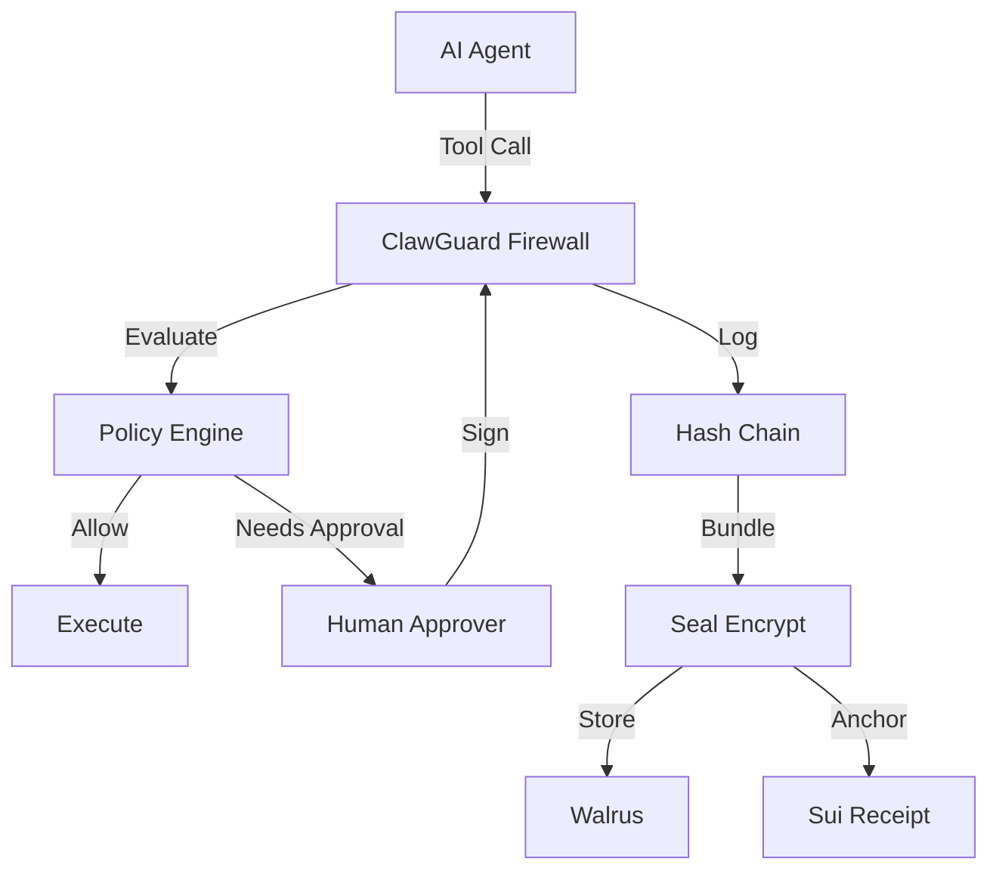

# ClawGuard 🛡️

**The Policy Firewall & Digital Blackbox for AI Agents**

> **ClawGuard turns any OpenClaw agent into a cryptographically auditable firewall**: every risky action is proposed, policy-checked, approved, logged, and anchored to Sui/Walrus for post-mortem verification.

> **Designed for Suixclaw**: every decision (`allow` / `deny` / `needs_approval`) is machine-parseable, and every session has a verifiable Seal + Walrus + SessionReceipt trail so agents can audit other agents.

> **TL;DR for agents**: "Given a ClawGuard `SessionReceipt` object ID, I can fetch the Walrus blob, decrypt via Seal (if I hold AccessCap), recompute the log hash chain, and prove exactly what this agent did during that session."


---

## 🔴 The Problem

**Agents have root.** One prompt injection or model bug can `rm -rf /` or drain wallets. Worse, logs can be tampered post-incident—making forensics unreliable.

---

## ✨ Key Capabilities

### 1. Policy Firewall (Default-Deny)
Define a `policy.yaml` that decides **allow / deny / needs_approval** before anything runs. Supports **Untrusted Source Gating**: force approval for risky tools if the request comes from web/email/clipboard.

### 2. Tamper-Evident Flight Recorder
Every proposal, approval, and execution is appended to a cryptographic hash-chain log. On startup, the server verifies the chain and refuses to run if history is corrupted (fail-closed).

### 3. Proof of Privacy (Seal Encryption)
Session bundles are encrypted with **Sui Seal** locally (when `SEAL_PACKAGE_ID` is configured). Decryption is strictly gated by owning the correct on-chain **AccessCap** NFT—raw logs never leave the machine in plaintext.

### 4. Proof of Permanence (Walrus Storage)
Encrypted session bundles are uploaded to **Walrus**, producing a permanent `blobId`. Logs are stored with `deletable: false`, creating a durable audit trail that survives crashes or server wipes.

### 5. Proof of Truth (On-Chain SessionReceipts)
When running with real keys, the server publishes a `SessionReceipt` object on Sui containing the Walrus blob ID and policy/log hashes. Pure on-chain verification allows re-deriving the entire history from the receipt alone.

### 6. Signed Approvals + Replay Protection
When an action requires approval, the server issues a canonical payload. Users sign offline with their Sui wallet. Signatures are verified and nonces tracked to prevent replay.

### 7. "Plan B" Delegate Permits
For external agents executing tools locally, the server mints short-lived signed permits bound to specific proposals. Agents report completion, closing the audit loop.

### 8. Execution Hardening (Verified)
- **No Shell Injection**: Commands run via `spawnSync(shell: false)`.
- **Interpreter Blocking**: Policy explicitly blocks `sh -c`, `python -c`, etc.

---

## 🧪 Verify in 5 Minutes (For Judges)

> **Prerequisites**: `pnpm`, Node 20+, and access to Sui testnet (for on-chain modes).

```bash
# Clone and build
git clone https://github.com/jayjoshix/clawdefender.git
cd clawdefender && pnpm install && pnpm build

# 1. See policy in action: malicious DENIED, benign ALLOWED
pnpm demo
# Expected: cat ~/.ssh/id_rsa → DENIED, rm -rf / → DENIED, ls -la /tmp → ALLOWED

# 2. Verify log chain + Walrus bundle (off-chain)
pnpm demo -- --verify

# 3. Prove decryption fails without AccessCap (adversarial)
pnpm demo -- --verify-denied

# 4. Pure on-chain verification (trusts only Sui + Walrus)
pnpm demo -- --receipt 0x<Sui_Receipt_Object_ID>
# Example (testnet): pnpm demo -- --receipt 0xaa9a4db701295141cbb05705c1280a6162816fdc
```

### 🌐 Verification Portal (Web UI)

Prefer a GUI? Run the Next.js verification app:

```bash
cd apps/web && pnpm dev
# Open http://localhost:3000/verify
```
Enter a **Session Receipt ID** (generated by `pnpm demo` when `SUI_KEYPAIR` is set).

> **Note**: Without a funded wallet (`SUI_KEYPAIR`), the demo runs in **Simulation Mode** and does not create an on-chain receipt object.

### 🤖 Audit Recipe (for Agents)

To audit a session programmatically:

1. **Run**: `pnpm demo -- --receipt <SESSION_RECEIPT_ID>`
2. **Extract JSON**: Parse the last line of stdout (compact JSON summary)
3. **Verify Invariants**:
   - `extracted.finalLogHash == SessionReceipt.final_log_hash`
   - `computed.bundleSha256 == SessionReceipt.bundle_sha256`
   - `SessionReceipt.blobId` resolves to valid Walrus ciphertext

---

## 🔗 Sui Integration

| Component | Usage |
|-----------|-------|
| **Seal** | Threshold encryption (Sui Seal package); decryption gated by on-chain AccessCap |
| **Walrus** | Durable ciphertext storage with epochs |
| **SessionReceipt** | Move object containing `policyHash`, `finalLogHash`, `blobId`, `bundleHash` |
| **AccessCap** | On-chain capability controlling who can decrypt logs |

> **Simulation Mode**: If `SEAL_PACKAGE_ID` or `SUI_KEYPAIR` are not set, ClawGuard runs in simulation mode: Walrus upload still happens, but SessionReceipt minting is skipped and clearly logged. Judges can still run `--verify` off-chain; `--receipt` requires a real Seal package.

---

## 🏆 Hackathon Scoring

### Technical Merit
- Nonce-tracked approvals prevent replay
- `argsHash` / `policyHash` / `entryHash` binding ensures integrity
- Log rehydration is **fail-closed**: on startup, `verifyLogChain()` runs before trusting any previous entries; if verification fails, it rotates the log and refuses to reuse state
- Agent Plan B execution via permit system

### Creativity
- **"Black box flight recorder"** pattern for agents
- Verifiable post-hoc proofs anchored on-chain
- Context-aware PBAC (same command allowed/denied based on source)

### Sui Integration
- Seal-based encryption with on-chain access control
- Walrus as immutable ciphertext layer
- SessionReceipt on Sui as root of trust

---

## 🔌 Use With Your Agent

In OpenClaw, route tools through ClawGuard by swapping direct shell/network/filesystem calls for `propose → (optional approve) → execute`. The included `@clawguard/openclaw-adapter` wraps these endpoints into an OpenClaw-compatible tool client.

```typescript
import { ClawGuardClient } from '@clawguard/openclaw-adapter';

const client = new ClawGuardClient('http://localhost:3000', process.env.CLAWGUARDTOKEN);

// Inside your OpenClaw agent tool implementation:
const result = await client.proposeAction('shell', 'exec', { command: 'ls -la' });

// If needs_approval → wait for human signature via Telegram/API
// If allow → execute immediately
// If deny → blocked

// Prove your agent's behavior from chain alone:
// pnpm demo -- --receipt <id>
```

### Why Track 2 ("Jarvis") Teams Should Care
- Protect your always-on assistant from `rm -rf` and wallet drains without touching your agent logic
- Get a ready-made, on-chain-verifiable audit trail you can show in *your* Track 2 submission with one command: `pnpm demo -- --receipt <id>`

---

## ❓ FAQ for Judges

**Q: What if the log is corrupted?**  
A: `verifyLogChain()` recomputes all hashes and compares against the on-chain `finalLogHash`. Corruption is detected and rejected.

**Q: What if the approver key is compromised?**  
A: Each approval is nonce-bound to a specific proposal. Replay is impossible. Remove compromised addresses from `approvers.yaml`.

**Q: Does this prevent prompt injection?**  
A: It **contains the blast radius**. A malicious command is either denied by policy, requires human approval, or is logged immutably for post-incident analysis.

**Q: What's the trust model?**  
A: The on-chain SessionReceipt is the root of trust. Local JSON files are convenience copies. Always verify with `--receipt <id>`.

---

## 📦 Quick Start

```bash
pnpm install && pnpm build
pnpm demo                           # Full E2E demo
pnpm test                           # Run all tests
```

> [!CAUTION]
> **Local Development Only**: Set `CLAWGUARDTOKEN` before exposing to any network.

> [!IMPORTANT]
> **Trust Boundary**: The on-chain receipt is the source of truth. Verify with:
> ```bash
> pnpm demo -- --receipt 0x<Sui_Receipt_Object_ID>
> ```

---

## 📖 Full Documentation

<details>
<summary><strong>1. Policy Firewall</strong></summary>

Every tool call is evaluated against `policy.yaml`:

```yaml
rules:
  shell:
    deny:
      - { pattern: "rm -rf /", reason: "Catastrophic deletion" }
      - { pattern: "bash -c *", reason: "Interpreter bypass" }
    needs_approval:
      - { pattern: "*", conditions: { untrusted_source: [web, email] }, reason: "Untrusted source" }
    allow:
      - { pattern: "ls *", reason: "Safe read-only" }
```

**Decision Types**: `allow` (execute) | `deny` (block) | `needs_approval` (wait for signature)

</details>

<details>
<summary><strong>2. Context-Aware Authorization (PBAC)</strong></summary>

Add attribute-based conditions to rules:

```typescript
const result = await client.proposeAction('shell', 'exec', 
  { command: userInput },
  { untrustedSource: 'web' }  // PBAC attribute
);
// → needs_approval (web input requires human sign-off)
```

</details>

<details>
<summary><strong>3. Execution Hardening</strong></summary>

- Commands run with `spawnSync(shell: false)` — no metacharacter injection
- Interpreter bypass patterns explicitly denied: `bash -c`, `sh -c`, `python -c`, etc.

</details>

<details>
<summary><strong>4. Human-in-the-Loop Approvals</strong></summary>

```
Agent → POST /v1/propose_action → "needs_approval"
Human → GET /v1/approval_payload/:id → Signs with Sui wallet
Human → POST /v1/approve_action → Proposal approved
Agent → POST /v1/execute_action → Action runs
```

Telegram integration available for mobile approvals.

</details>

<details>
<summary><strong>5. Tamper-Evident Logging</strong></summary>

```json
{"event":"propose","prev_hash":"abc123","entry_hash":"def456"}
{"event":"approve","prev_hash":"def456","entry_hash":"ghi789"}
{"event":"execute","prev_hash":"ghi789","entry_hash":"jkl012"}
```

If any entry is modified, the hash chain breaks.

</details>

<details>
<summary><strong>6. Seal Encryption</strong></summary>

Session logs encrypted with Sui Seal threshold encryption. Only wallets with AccessCap can decrypt.

</details>

<details>
<summary><strong>7. Walrus Storage</strong></summary>

Encrypted bundles stored on Walrus decentralized storage. Immutable and verifiable via Blob ID.

</details>

<details>
<summary><strong>8. On-Chain Receipts</strong></summary>

SessionReceipt on Sui contains:
- `policyHash`: Policy version
- `finalLogHash`: Root of log chain
- `blobId`: Walrus storage reference
- `bundleHash`: Integrity check

</details>

---

## 🔒 Security Guarantees

| Threat | Prevention | Observable In |
|--------|------------|---------------|
| Log Tampering | Hash chaining (`prev_hash` → `entry_hash`) | `verify-log` script |
| Log Deletion | On-chain receipt anchors final hash | Sui receipt object |
| Replay Attacks | Nonces + `executed` flag per proposal | `NonceTracker` |
| Shell Injection | `spawnSync(shell: false)` | `server/index.ts:901` |
| Interpreter Bypass | Explicit deny rules (`bash -c *`) | `policy.yaml` |
| Untrusted Input | PBAC conditions (`untrusted_source`) | Policy evaluator |

---

## 📱 Human-in-the-Loop Approval via Telegram

ClawGuard acts as a **Cryptographic Firewall** for your agent. When an agent attempts a sensitive action (e.g., executing shell commands):

1.  **Block & Notify**: The action is blocked (`needs_approval`), and you receive a Telegram notification.
2.  **Verify**: You see exactly what the agent wants to do.
3.  **Sign Offline**: You approve by signing the request **offline** with your Sui wallet.
4.  **Authorize**: The signature is sent back, and only *then* does the action execute.

**Why?**
-   **No "Click Fatigue"**: Requires cryptographic intent, not just a button press.
-   **Non-Repudiation**: Every high-stakes action is cryptographically linked to your identity on-chain.
-   **Blast Radius Containment**: Even if the agent is compromised, it cannot authorize its own critical actions.

See [Walkthrough](walkthrough.md#5-manual-approval-workflow-verified) for setup instructions.

---

## 📡 API Reference

```
GET  /v1/status                       # Health + policy hash
POST /v1/propose_action               # Submit action
GET  /v1/approval_payload/:proposalId # Get signable payload
POST /v1/approve_action               # Submit signature
POST /v1/execute_action               # Execute (Plan A)
POST /v1/complete_action              # Report result (Plan B)
```

**Decision Literals**: `'allow' | 'deny' | 'needs_approval'`

---

## ⚙️ Configuration

| Variable | Description |
|----------|-------------|
| `CLAWGUARDTOKEN` | API auth token (required for production) |
| `SEAL_PACKAGE_ID` | Sui Seal package ID |
| `SUI_KEYPAIR` | Sui private key (bech32) |
| `WALRUS_PUBLISHER_URL` | Walrus endpoint |

**Simulation Mode**: Runs locally without blockchain when `SEAL_PACKAGE_ID` is unset.

> [!WARNING]
> **Proxy Trust**: Configure `trustProxy` appropriately behind reverse proxies to prevent IP spoofing.

---

## 🧪 Testing

```bash
# Core tests (28 tests)
cd packages/clawguard && pnpm test

# PBAC tests (6 tests)
npx tsx test/pbac_test.ts

# Telegram integration tests
cd packages/openclaw-adapter && pnpm test

# Live Telegram approval
export TELEGRAM_BOT_TOKEN="..."
export TELEGRAM_CHAT_ID="..."
curl -X POST localhost:3000/v1/propose_action \
  -H "Authorization: Bearer test" \
  -d '{"tool":"shell","action":"exec","args":{"command":"ls"},"meta":{"untrustedSource":"web"}}'
```

---

## 📐 Architecture



---

## 📜 License

MIT
